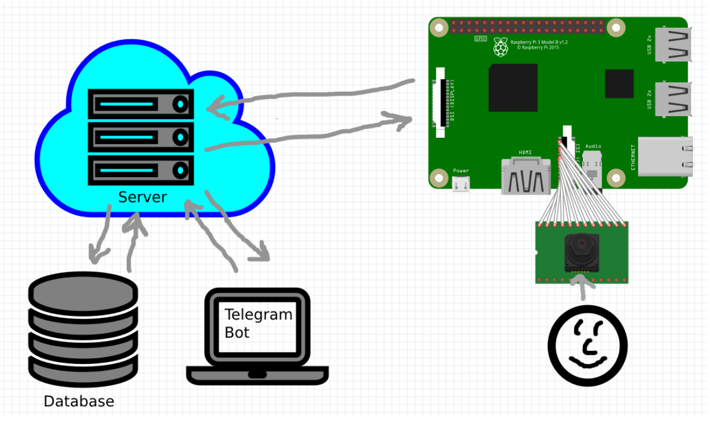
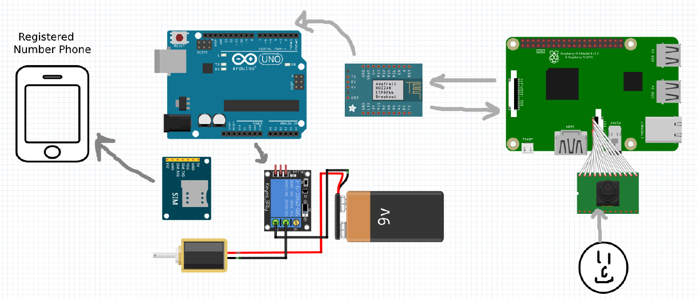

# smart_lock
Smart door lock, an IoT project

---
RaspberryPie image processing code: [Link to Google drives](https://drive.google.com/drive/folders/1c-gNpFKNy3-2BsFqZvMNssiIvMIoAko9?usp=sharing) (programmer: ah_vahed)

####Communications between RaspberryPie and DB when user stands in front of the camera.

   

####Communications between RaspberryPie and Arduino, Esp8266 and lock itself when user stands in front of the camera.
